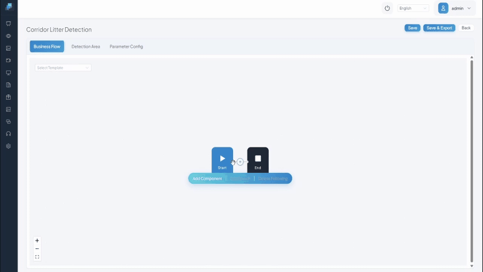

<!--
Repository metadata suggestion:

Description:
C++ native industrial edge AI engine with visual pipeline orchestration, on-device VLM support, and real-time OSD for video analytics.

Topics:
cpp, c-plus-plus, computer-vision, video-analytics, edge-ai, edge-computing,
object-detection, video-processing, rtsp, webrtc, mqtt, inference,
visual-programming, workflow-orchestration, industrial-ai,
vision-language-model, vlm, sophon, bm1688, real-time
-->

<div align="center">

<!-- TODO: Replace with final logo asset. -->
<!--  -->

# CosmoEdge

**C++ Native Industrial Edge AI Engine with Visual Pipeline Orchestration**

[](LICENSE)
[](#cpp-native-runtime)
[](#supported-platforms)
[](https://github.com/cosmoedge/cosmoedge/releases)
[](#validation)
[](#validation)

[Quick Start](#quick-start) | [Features](#key-features) | [Showcases](#showcases) | [Validation](#validation) | [Docs](#documentation) | [Hardware](#cosmoedge-ready-devices)

</div>

---

<!--
TODO before public launch:
- Replace all placeholder image paths with real assets.
- Confirm Quick Start commands.
- Confirm benchmark values and attach a reproducible test report.
- Confirm the exact public repo URL.
- Confirm certified hardware URL.
-->

<div align="center">


*Multiple AI pipelines, real-time OSD, and live event output on one edge device.*

</div>

CosmoEdge is a C++ native edge AI engine for building production-oriented video analytics systems on edge devices. It turns models into visual, manageable applications: import a model, compose a pipeline, connect video sources, watch AI overlays in the browser, and push structured events to MQTT or HTTP.

The runtime is built in C++ for efficient multi-channel video processing, hardware decoding, OSD rendering, and low-overhead edge deployment. Python remains excellent for research, experimentation, and model tooling; CosmoEdge is optimized for the part where integrators need long-running edge applications with predictable resource usage.

Instead of stopping at an inference API or demo script, CosmoEdge focuses on the next step: helping integrators turn AI models into complete edge applications that can be deployed, monitored, debugged, and maintained.

## What You Can Build

- Multi-camera safety monitoring with real-time OSD and event snapshots.
- People counting, line crossing, zone intrusion, and traffic statistics.
- Visual inspection workflows powered by on-device VLM prompts.
- Long-tail object detection with text-prompted GroundingDINO.
- End-to-end edge AI systems with model management, scenario tasks, alarms, and data push.

## Screenshots

<!--
TODO: Replace placeholders with real screenshots.
Recommended set:
1. Visual Pipeline Orchestrator
2. Real-time AI Analytics
3. Web Management Console
4. VLM Visual Inspection
-->

<table>
<tr>
<td align="center" width="50%">

<!--  -->
<b>Visual Pipeline Orchestrator</b><br>
<sub>Drag-and-drop AI workflow builder powered by Vue Flow.</sub>

</td>
<td align="center" width="50%">

<!--  -->
<b>Real-time AI Analytics</b><br>
<sub>Multi-channel video with live AI overlays and status indicators.</sub>

</td>
</tr>
<tr>
<td align="center" width="50%">

<!--  -->
<b>Web Management Console</b><br>
<sub>Scenario tasks, model repository, event center, and system monitoring.</sub>

</td>
<td align="center" width="50%">

<!--  -->
<b>VLM Visual Inspection</b><br>
<sub>Change the prompt, change the inspection rule, no retraining required.</sub>

</td>
</tr>
</table>

## Key Features

### C++ Native Runtime

CosmoEdge is built around a C++17 runtime rather than a Python service loop. This matters for edge video systems where decode, inference scheduling, OSD rendering, event generation, and stream output all run continuously on resource-constrained devices.

- Lower runtime overhead for long-running multi-channel video workloads.
- Direct integration with hardware decode, NPU runtime, memory pools, and streaming components.
- Better fit for appliance-style edge devices where predictable CPU, memory, and thread behavior matter.
- Same engine core for x86 developer mode and Sophon production deployment.

### Visual Pipeline Orchestration

Build video AI workflows in a browser. Connect video sources, AI models, post-processing nodes, OSD rendering, alarm rules, and output channels with a visual pipeline editor.

<!-- TODO: Replace with real 8-10s GIF. -->
<!--  -->

### Complete Application Loop

CosmoEdge is not only an inference runtime. It includes the application layer needed to operate AI vision systems in the field.

```text
Model Repository -> Scenario Task -> Real-time Analysis -> Alarm Management -> Data Push
       |                  |                 |                   |              |
  Upload/manage       Configure        Multi-channel        Rule engine   MQTT / HTTP
  ONNX/bmodel         pipelines        AI + OSD overlay     snapshots     webhook
  model versions      per scene        WebRTC streaming     event log     integration
```

<details>
<summary><b>Full capability list</b></summary>

| Module | Capabilities |
| --- | --- |
| Model Repository | Model upload, metadata management, version management, hot-swap workflow |
| Scenario Tasks | Pipeline binding, camera binding, scheduling, scene-level configuration |
| Real-time Analysis | RTSP, video files, USB cameras, WebRTC live view, HTTP-FLV fallback |
| Image Analysis | Batch image upload, VLM analysis, structured results |
| Alarm Management | Rule-based alarms, severity levels, snapshots, filtering, event history |
| Data Integration | MQTT push, HTTP webhook, structured JSON event format |
| System Management | Dashboard, device status, user auth, i18n, configuration management |

</details>

### Real-time Visual Debugging

CosmoEdge includes a production-oriented OSD system designed for operators and developers:

- Business labels instead of raw model class names.
- Semantic colors for normal, warning, violation, and uncertain states.
- Zone overlays, line-crossing indicators, counters, and event panels.
- Debug view for raw detections, confidence scores, track IDs, and model output.

### Multi-channel Edge Runtime

The C++ engine is designed for multi-channel video analytics on edge hardware. On Sophon BM1688, CosmoEdge has been internally verified with 16-channel CV inference workloads.

> TODO: Publish the exact benchmark setup before launch: device model, SDK version, resolution, codec, input source, model version, duration, and whether OSD/streaming are included.

### On-device VLM and Open-vocabulary Detection

CosmoEdge supports large-model style visual reasoning on edge devices:

| Capability | How it works | Typical use |
| --- | --- | --- |
| Edge VLM | Ask a closed question and map the answer to YES/NO/Enum events | "Is there debris on the floor?" -> alarm on YES |
| VLM Image Analysis | Upload images and run structured visual checks | Quality inspection, compliance review |
| GroundingDINO | Text prompt to open-vocabulary detection | Long-tail objects without task-specific training |

Certified device packages can include a fine-tuned 0.8B edge VLM and production-ready CV models. The open-source engine can also run user-provided models through the same workflow.

> TODO: Confirm the public model name, parameter count, quantization format, and measured latency before using the 0.8B VLM claim in a release.

### Zero-barrier Developer Mode

Try the full UI and workflow on standard x86 hardware:

- x86 Linux and Windows support for development and evaluation.
- Same UI and workflow as edge deployment.
- Lower throughput than Sophon NPU mode, but enough for onboarding, testing, and integration work.

### Model Sources

**Validated end-to-end in CosmoEdge:**

Models listed below have full pipeline support — detection, OSD rendering, tracking, alarm rules, and event output work out of the box.

| Category | Verified Architectures | Pipeline Support |
|:---|:---|:---|
| Object Detection | YOLOv5, YOLOv8, YOLOv10, YOLOv11 | Full pipeline |
| Object Tracking | ByteTrack | Full pipeline |
| Attribute Classification | Safety helmet, vest, uniform classifiers | Full pipeline |
| Counting & Statistics | Line crossing, zone counting, directional flow | Full pipeline |
| Open-vocabulary Detection | GroundingDINO | Async pipeline node |
| Visual State Judgment | Edge VLM (text prompt → YES/NO/Enum) | Async pipeline node |
| Image Analysis | VLM batch analysis | Standalone task |

**Model ecosystem compatibility:**

CosmoEdge uses ONNX as the model interchange format. Models from major CV training frameworks can be imported through a documented conversion path:

- **Ultralytics (YOLO)**: Export with `yolo export format=onnx`, then import via Model Repository or convert to bmodel for NPU deployment.
- **Roboflow**: Train on Roboflow, export ONNX, import into CosmoEdge.
- **Custom models**: Any ONNX-compatible detection or classification model can be integrated through the model porting guide.

**Broader Sophon model ecosystem:**

CosmoEdge runs on the Sophon BM1688 inference stack. Models from SOPHGO's official model zoo can be integrated through the model porting guide, which covers post-processing adaptation and pipeline node registration.

→ [SOPHGO Model Zoo (sophon-demo)](https://github.com/sophgo/sophon-demo)  
→ [CosmoEdge Model Porting Guide](docs/model-porting.md)

## Quick Start

### Option A: x86 Developer Mode

No edge hardware is required for the first experience.

```bash
# 1. Clone
git clone https://github.com/cosmoedge/cosmoedge.git
cd cosmoedge

# 2. Start in x86 mode
# TODO: Confirm the final public launch command.
# Preferred release target:
docker compose -f docker-compose.x86.yml up -d

# Alternative if Docker is not ready:
# ./scripts/start_x86.sh

# 3. Open the web console
# http://localhost:8080
```

Expected first path:

```text
Open browser -> import or select model -> create scenario task -> connect video -> view AI results
```

### Option B: Sophon Edge Device

Use this path for NPU-accelerated deployment.

```bash
# 1. Clone
git clone https://github.com/cosmoedge/cosmoedge.git
cd cosmoedge

# 2. Build for Sophon
mkdir build && cd build
cmake .. -DPLATFORM=SOPHON -DCMAKE_TOOLCHAIN_FILE=../cmake/sophon.toolchain.cmake
make -j$(nproc)

# 3. Deploy
./scripts/deploy.sh --target <device-ip>

# 4. Open the web console
# http://<device-ip>:8080
```

> Ready for production hardware? Certified CosmoEdge devices provide preconfigured Sophon acceleration, production model packages, and deployment support. See [CosmoEdge-ready devices](#cosmoedge-ready-devices).

## Showcases

<!-- TODO: Replace each placeholder with GIF or screenshot. -->

<table>
<tr>
<td align="center" width="33%">

<!--  -->
<b>Pedestrian Flow Analysis</b><br>
<sub>Detection + tracking + line crossing + counting + MQTT.</sub>

</td>
<td align="center" width="33%">

<!--  -->
<b>Construction Site Safety</b><br>
<sub>Hardhat and vest compliance with semantic OSD and alarms.</sub>

</td>
<td align="center" width="33%">

<!--  -->
<b>VLM Smart Inspection</b><br>
<sub>Prompt-driven state judgment for long-tail inspection rules.</sub>

</td>
</tr>
</table>

## Validation

CosmoEdge is built from a commercial codebase and has gone through internal system validation before open-source release.

| Area | Current validation status |
| --- | --- |
| Video stress test | 200 video samples used in continuous playback testing, with no memory leak or crash observed during the test |
| CV pipeline validation | 18/18 CV pipelines precision-aligned against internal industry baselines |
| Concurrent CV workload | 16-channel CV inference verified on a single BM1688 device |
| Regression testing | Multi-round system regression with dedicated QA |
| Pilot deployments | Validated in de-identified pilot scenarios across education, smart campus, and industrial safety |

> TODO: Link to a public validation report before formal v1.0 release. The report should include test duration, device configuration, input resolution, model versions, and known limitations.

### Performance Benchmarks

The numbers below are release-candidate benchmark targets based on internal records. Confirm and replace them with reproducible measurements before public launch.

| Workload | Channels | FPS per channel | Inference latency | Hardware | Notes |
| --- | ---: | ---: | ---: | --- | --- |
| YOLOv8n detection | 16 | 25 | TODO | BM1688 | Include decode, inference, and OSD in final report |
| Hardhat and vest detection | 8 | 25 | TODO | BM1688 | Multi-class safety scenario |
| GroundingDINO | 1 | TODO | TODO | BM1688 | Text-prompted detection |
| VLM state judgment | 1 | TODO | TODO | BM1688 | Async slow path, not frame-synchronous OSD |
| YOLOv8n dev mode | 1 | TODO | TODO | x86 CPU | Development and evaluation only |

## Architecture

```text
+---------------------------------------------------------------+
| Web Frontend                                                  |
| Pipeline Editor | Management Console | Real-time View          |
+-------------------------------+-------------------------------+
                                | REST / WebSocket / MQTT
                                v
+---------------------------------------------------------------+
| C++ Engine Core                                               |
| Flow Engine | Media Pipeline | Inference | Services            |
| Task/Action | Decode/Encode | CV/VLM/DINO | Alarm/Event/Model  |
+-------------------------------+-------------------------------+
                                |
                                v
+---------------------------------------------------------------+
| Hardware Abstraction                                          |
| Sophon BM1688 NPU/VPU/VPP | x86 CPU/OpenCV                    |
+---------------------------------------------------------------+
```

### Tech Stack

| Layer | Technology |
| --- | --- |
| Engine | C++17, CMake, FFmpeg, OpenCV, SQLiteCpp |
| Inference | Sophon BMRT/SAIL, ONNX Runtime for x86 mode |
| Frontend | Vue.js, Vue Flow, Element Plus |
| Streaming | SRS 6.0, WebRTC, HTTP-FLV |
| Integration | REST API, WebSocket, MQTT, HTTP webhook |

## Supported Platforms

| Platform | Status | Intended use |
| --- | :---: | --- |
| Sophon BM1688 | Primary | NPU-accelerated production deployment |
| x86 Linux | Supported | Development, evaluation, integration testing |
| x86 Windows | Supported | Development and evaluation |
| Sophon BM1684X | Planned | NPU-accelerated deployment |

## CosmoEdge-ready Devices

CosmoEdge is open source. The repository provides the same engine, web UI, and workflow used by certified device packages. You can bring your own models, run on x86 for development, and deploy on compatible edge hardware.

Certified devices are for teams that want to skip hardware bring-up and model packaging. They add preconfigured NPU acceleration, production model packages, and dedicated support.

| Capability | Open-source repository | Certified device package |
| --- | :---: | :---: |
| C++ engine | Included | Included |
| Visual pipeline orchestrator | Included | Included |
| Web management console | Included | Included |
| x86 developer mode | Included | Included |
| Sophon NPU runtime support | Source support, hardware required | Preconfigured |
| CV model package | Bring your own models | Pre-installed |
| 0.8B edge VLM | Bring your own or custom package | Pre-installed |
| GroundingDINO package | Bring your own or custom package | Pre-installed |
| Deployment support | Community | Dedicated |

Certified devices add deployment readiness, not locked software features.

<!-- TODO: Replace with final hardware page URL. -->
[Get a certified device](https://cosmoedge.dev/hardware)

## Documentation

| Document | Audience | Description |
| --- | --- | --- |
| Quick Start Guide | Everyone | First working experience in minutes |
| Scenario Configuration | Integrators | Build scene-level AI workflows |
| VLM Guide | Developers | Use visual state judgment with prompts |
| Pipeline Orchestration | Advanced users | Compose custom pipelines visually |
| Model Porting Guide | ML engineers | Bring your own ONNX or target model |
| API Reference | Developers | REST API, MQTT events, configuration schema |
| Architecture Overview | Contributors | Engine internals and extension points |
| Deployment Guide | DevOps | Production deployment and troubleshooting |

<!-- TODO: Replace rows above with real links after docs paths are finalized. -->

## Roadmap

- [x] C++17 edge inference engine
- [x] Visual pipeline orchestrator
- [x] Web management console
- [x] x86 developer mode for Linux and Windows
- [x] VLM and GroundingDINO integration
- [x] 18 CV pipelines internally validated
- [ ] Public x86 one-command startup
- [ ] Public validation report
- [ ] Release packaging for v1.0
- [ ] Community model and scenario examples
- [ ] GB28181 protocol support

## Contributing

CosmoEdge is in active development toward v1.0. Contributions are welcome in focused areas:

- Bug reports with logs and reproduction steps.
- Documentation fixes and tutorial improvements.
- Scenario examples and integration notes.
- Small, scoped pull requests discussed through issues first.

Please read [CONTRIBUTING.md](CONTRIBUTING.md) before opening a pull request.

## FAQ

<details>
<summary><b>Do I need a Sophon device to try CosmoEdge?</b></summary>

No. Use x86 developer mode on Linux or Windows to try the UI, pipeline workflow, model management, and integration path. Sophon hardware is needed for production-level NPU throughput.

</details>

<details>
<summary><b>Does the open-source repository include model weights?</b></summary>

The open-source repository focuses on the engine, UI, and workflow. You can bring your own models and follow the model porting guide. Certified device packages can include pre-installed production CV models, a fine-tuned edge VLM, and GroundingDINO.

</details>

<details>
<summary><b>Can I use my own trained models?</b></summary>

Yes. CosmoEdge is designed around model import and model lifecycle management. The final public guide will document the recommended path from ONNX or target runtime formats into the model repository.

</details>

<details>
<summary><b>How is CosmoEdge different from inference servers or NVR projects?</b></summary>

CosmoEdge combines three layers in one edge system: a C++ video AI runtime, a visual pipeline builder, and a web management console for scenarios, alarms, model lifecycle, OSD, and data push. The goal is not only to run models, but to help integrators operate complete edge AI applications.

</details>

<details>
<summary><b>Is CosmoEdge production-ready?</b></summary>

The codebase comes from production-oriented commercial development and has passed internal stress, pipeline, and regression validation. The first public release is still marked v0.1.0 while public APIs, packaging, and contributor workflows stabilize toward v1.0.

</details>

## Contact

- 💬 Community: [GitHub Discussions](https://github.com/cosmoedge/cosmoedge/discussions)
- 📧 Partnership & Enterprise: cosmoedge@cosmowanderer.com

## License

CosmoEdge is licensed under the [Apache License 2.0](LICENSE).

```text
Copyright 2026 CosmoEdge Contributors

Licensed under the Apache License, Version 2.0
```

---

<div align="center">

Built by Cosmos Wanderer AI Technology

Industrial edge intelligence, from model to production.

</div>
