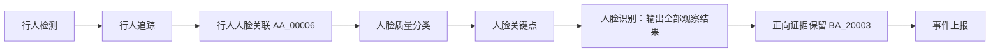

# 按行人轨迹判断陌生人

BM1688、CV186X 和 x86 资源均提供独立场景 **66：陌生人告警**。RK3576、RV1126B 打包继承 x86 的场景模板、组件配置和中英文文案，再叠加各自的模型资源。原有场景 2 的人脸比对告警继续使用原来的输出模式。

## 判定规则

同一行人轨迹只要出现一次有效人脸识别成功，该轨迹就不再产生陌生人告警。追踪器不再输出该轨迹后，额外等待结束时间；满足最短观察时间、最少有效比对次数，且所有有效比对都未命中，才上报该轨迹的最佳人脸抓拍。

无脸、小脸、低质量脸、侧脸（启用正脸限制时）、区域外目标和无法唯一归属的人脸不增加失败次数。未选择脸库、所选脸库不可搜索、推理失败或长时间输入中断，会使该轨迹放弃陌生人判定。只凭“未看到脸”不能判定陌生人。

判定依据是追踪器的轨迹 UUID。短暂遮挡在轨迹仍被保持时不会结束观察；发生 ID 切换时，新轨迹会重新收集证据。本场景没有跨轨迹或跨摄像头身份合并。

## 组件复用



`AA_00006` 调用现有检测模型池，在整帧检测人脸，再将人脸关联到唯一的行人上半身，保留行人的轨迹、区域信息和未观察到脸的帧。多人重叠或一个行人框包含多张脸时跳过关联。

人脸识别 `AA_00005` 的 `outputMode=observations` 输出完整观察结果。`BA_20003` 的 `inputMode=recognition` 复用正向证据保留机制，累计有效未命中并在轨迹结束时判断。默认的行为判断和识别告警模式仍可使用。

模板沿用现有人脸流程的模型编号 `1001003`、`1000001`、`1000012`、`1000016`、`1000005`，分别用于行人检测、人脸检测、质量分类、关键点和特征提取。运行前须在目标设备安装对应模型；编号相同不代表模型文件可跨芯片复用。x86 使用 ONNX，Sophon 和 Rockchip 使用对应目标的模型产物。当前仓库内置的公开基准模型不包含完整人脸模型链，模板同步不代表各平台可直接运行，也不代表模型转换或实机验证已完成。

## 配置

在算法列表选择“陌生人告警”，绑定摄像头、区域和已有人员的人脸分组。必须选择包含有效人脸特征的分组。

| 参数 | 默认值 | 含义 |
| --- | --- | --- |
| `param.minFaceSize` | 60 | 人脸宽、高均至少为 60 像素 |
| `param.faceDetectionConfidence` | 0.66 | 人脸检测置信度 |
| `param.minFaceQuality` | 60 | 现有人脸质量评分下限，范围 0–100 |
| `param.frontFaceOnly` | 1 | 仅使用正脸 |
| `param.limitScore` | 0 | 0 使用脸库自身阈值；也可指定 0–100 的阈值 |
| `param.minValidFaceCount` | 3 | 最少有效未命中比对次数 |
| `param.posSenDurationTime` | 3000 | 轨迹最短观察时长，毫秒 |
| `param.trackLostTimeoutMs` | 1000 | 追踪器不再输出轨迹后的额外等待时间 |
| `param.faceSampleIntervalMs` | 200 | 两次有效失败计数的最小间隔，毫秒；成功始终生效 |

观察时长倍率 `param.posSenDurationTimeType` 固定为 1。模板使用 5 FPS 行人检测，后续节点全量透传。区域级告警间隔和位置抑制关闭，以允许多人同时离开时分别上报。每条轨迹在各命中区域最多上报一次，抓拍采用该轨迹质量最高的有效未命中帧。

停止或重启任务、切换视频会话、更换绑定分组或识别质量/比对阈值时，会清理对应的未完成证据。轨迹结束告警存在等待延迟，不能承诺人在画面中时立即告警。

## 验证

在配置好的 Linux CPU 开发环境运行：

```bash
bash scripts/build_cpu_test.sh
./build_cpu/cosmo-tests "[stranger]"
```

`test_stranger_alarm.cc` 覆盖关联、质量与证据判定；`test_stranger_alarm_flow.cc` 覆盖真实动作和队列的多人抓拍、成功保留、异常输入及会话重置。CPU 测试不替代目标设备实机验收；部署前应使用已知人员、陌生人、侧脸、遮挡、多人重叠、无人帧及断流视频检查误报、漏报与告警延迟。
