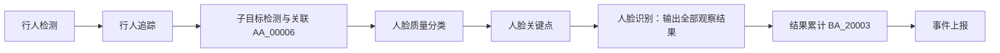

# 按行人轨迹判断陌生人

BM1688、CV186X 和 x86 资源均提供独立场景 **66：陌生人告警**。RK3576、RV1126B 打包继承 x86 的场景模板、组件配置和中英文文案，再叠加各自的模型资源。原有场景 2 的人脸比对告警继续使用原来的输出模式。

各平台的 `algorithm/` 包含场景 66 的正式算法配置，`algorithm_template/` 保留对应编排模板；两者使用相同流程和默认参数。部署后可直接选择“陌生人告警”，再绑定任务的人脸分组和检测区域。

## 判定规则

同一行人轨迹只要出现一次有效人脸识别成功，该轨迹就不再产生陌生人告警。追踪器不再输出该轨迹后，额外等待结束时间；满足最短观察时间、最少有效比对次数，且所有有效比对都未命中，才上报该轨迹的最佳人脸抓拍。

无脸、小脸、低质量脸、侧脸（启用正脸限制时）、区域外目标和无法唯一归属的人脸不增加失败次数。未选择脸库、所选脸库不可搜索、推理失败或长时间输入中断，会使该轨迹放弃陌生人判定。只凭“未看到脸”不能判定陌生人。

判定依据是追踪器的轨迹 UUID。短暂遮挡在轨迹仍被保持时不会结束观察；发生 ID 切换时，新轨迹会重新收集证据。本场景没有跨轨迹或跨摄像头身份合并。

## 组件复用



“子目标检测与关联” `AA_00006` 调用现有检测模型池，在整帧检测所选标签，再将检测结果关联到唯一的主目标。陌生人预置选择人脸模型和 `face` 标签，关联位置为上半部，最小包含比例为 0.9。组件保留行人的轨迹、区域信息和未观察到脸的帧；多人重叠或一个行人框包含多张脸时跳过关联。

人脸识别 `AA_00005` 的 `outputMode=observations` 输出完整观察结果。“结果累计” `BA_20003` 按同一行人轨迹累计比对结果：任一次识别成功则不报陌生人，否则在轨迹结束时根据有效未命中次数和观察时长判断。新建累计节点内部使用 `inputMode=auto`，自动接收人脸识别或逻辑判断的有效结果，不展示模式选择；陌生人预置及旧配置的 `inputMode=recognition` 保持原规则。历史行为模式仅保留配置兼容。

模板沿用现有人脸流程的模型编号 `1001003`、`1000001`、`1000012`、`1000016`、`1000005`，分别用于行人检测、人脸检测、质量分类、关键点和特征提取。运行前须在目标设备安装对应模型；编号相同不代表模型文件可跨芯片复用。x86 使用 ONNX，Sophon 和 Rockchip 使用对应目标的模型产物。当前仓库内置的公开基准模型不包含完整人脸模型链，模板同步不代表各平台可直接运行，也不代表模型转换或实机验证已完成。

## 配置

在算法列表选择“陌生人告警”，绑定摄像头、区域和已有人员的人脸分组。必须选择包含有效人脸特征的分组。

| 参数 | 默认值 | 含义 |
| --- | --- | --- |
| `param.minTargetSize` | 60 | 人脸宽、高均至少为 60 像素 |
| `param.detectionConfidence` | 0.66 | 人脸检测置信度 |
| `param.minFaceQuality` | 60 | 现有人脸质量评分下限，范围 0–100 |
| `param.frontFaceOnly` | 1 | 仅使用正脸 |
| `param.limitScore` | 0 | 0 使用脸库自身阈值；也可指定 0–100 的阈值 |
| `param.minValidObservationCount` | 3 | 最少有效判断次数；陌生人场景中为有效未命中比对次数 |
| `param.posSenDurationTime` | 3000 | 轨迹最短观察时长，毫秒 |
| `param.trackLostTimeoutMs` | 1000 | 目标消失等待时间；追踪器不再输出轨迹后的额外等待时间 |
| `param.observationIntervalMs` | 200 | 判断计数间隔，毫秒；满足条件的结果始终生效 |

最短观察时间直接填写毫秒，例如 3000 表示 3 秒。新配置的内部倍率 `param.posSenDurationTimeType` 固定为 1，不再展示倍率输入框；编辑已有配置时保留其内部参数。模板使用 5 FPS 行人检测，后续节点全量透传。区域级告警间隔和位置抑制关闭，以允许多人同时离开时分别上报。每条轨迹在各命中区域最多上报一次，抓拍采用该轨迹质量最高的有效未命中帧。

停止或重启任务、切换视频会话、更换绑定分组或识别质量/比对阈值时，会清理对应的未完成证据。轨迹结束告警存在等待延迟，不能承诺人在画面中时立即告警。

## 通用结果累计

“结果累计”支持“检测 → 追踪 → 逻辑判断 → 结果累计 → 事件上报”，也可在追踪后加入子目标关联、分类等组件。必须连接实际的逻辑判断或人脸识别观察输出；原始检测结果、默认的 `false`、未执行判断的分类结果均不能作为未满足的证据。暂不累计群组、跨轨迹或跨摄像头的结果。

上游条件应表达**期望满足的条件**，例如“识别到底库人员”或“完成规定动作”。同一轨迹满足一次就保留；轨迹结束时，只有始终未满足且有效次数、观察时间均达标才输出告警。每条轨迹在各命中区域最多上报一次，多人同时离开时分别保留抓拍。

逻辑判断区分成立、不成立和无法判断。缺失模型输出、缺少阈值、非有限分数、未支持的表达式、被过滤或区域外的目标都不增加未满足次数；推理失败和长时间输入中断会使受影响轨迹放弃未满足判定。无法判断的目标仍保持轨迹存活。改变逻辑判断参数、累计参数、区域配置或视频会话时，未完成的累计状态会清理。

普通逻辑结果选择有效未满足帧中主目标面积最大的一帧；人脸识别仍选择质量最高的有效未命中人脸，且陌生人告警不携带候选底库身份或照片。

任务参数只包含最少有效判断次数、最短观察时间、目标消失等待时间、判断计数间隔。旧参数 `param.minValidFaceCount`、`param.faceSampleIntervalMs` 仍可读取；重新编辑节点会保存通用名称，同一配置中新旧参数并存时以通用参数为准。已有隐藏模式和时间倍率保持兼容。

累计规则适合“全程未完成某事”。例如“全程未确认佩戴安全帽”需要上游在可判断的画面中明确给出佩戴结果；没有关联到安全帽本身仍是无法判断。如果要求“曾戴过但后来摘掉也告警”，使用持续时间或频次判断，而不是这条“一次满足即保留”的规则。

## 子目标检测与关联

编排方式为“主目标检测 → 主目标追踪 → 子目标检测与关联 → 后续分类、关键点或判断”。在前面的检测组件中选择主目标标签；在“子目标检测与关联”中选择关联检测模型和要关联的标签。关联组件复用主目标的轨迹 ID，不再单独追踪子目标。

| 编排配置 | 含义 |
| --- | --- |
| 关联检测模型、标签 | 只关联勾选的类别；未选标签时不产生可用关联结果 |
| 关联位置 | 子目标中心位于主目标的全部、上半部或下半部；新组件默认全部 |
| 最小包含比例 | 子目标面积落在主目标框内的比例，默认 0.9；不是两个框的 IoU |
| 最小关联目标尺寸、检测置信度 | 在任务参数中设置，默认 60 像素和 0.66；按实际模型和画面调整 |

例如，选择安全帽模型和对应标签并设置上半部，可将安全帽检测结果归到行人轨迹；选择车牌模型和对应标签，可将车牌归到车辆轨迹。标签必须与所选模型一致，后续节点也需使用对应的模型。这里提供的是同帧、基于位置、无歧义的一对一关联，不包含跨摄像头、跨轨迹身份合并、一对多或行为推断。关联失败不会直接生成“未戴安全帽”等缺失类告警。

一张子目标同时符合两个主目标，或者一个主目标内存在多个候选时，都会跳过关联。内部结果区分匹配、未找到、归属不明确、尺寸不足、上游过滤和检测失败；没有检测到人脸不计为识别失败。分类、关键点和后续判断处理有效关联结果，主目标轨迹仍用于累计和告警。

组件编号 `AA_00006` 保持不变。历史配置仍可使用 `param.minFaceSize`、`param.faceDetectionConfidence`；缺少新关联规则的旧配置沿用 `face`、上半部和 0.9 的规则。重新编辑旧节点时，会保留原阈值并保存通用参数名称。陌生人预置的其余识别和告警规则不变。

## 验证

在配置好的 Linux CPU 开发环境运行：

```bash
bash scripts/build_cpu_test.sh
./build_cpu/cosmo-tests "[stranger],[association],[accumulation]"
```

`test_target_association.cc` 覆盖通用关联；`test_stranger_alarm.cc` 和 `test_stranger_alarm_flow.cc` 覆盖原陌生人规则。`test_result_accumulation.cc`、`test_logic_observation.cc` 覆盖通用结果和缺失输入，`test_result_accumulation_flow.cc` 覆盖逻辑判断到累计的真实动作与队列、多人抓拍、一次满足、异常输入、参数兼容及会话重置。CPU 测试不替代目标设备实机验收；部署前应使用已知人员、陌生人、侧脸、遮挡、多人重叠、无人帧及断流视频检查误报、漏报与告警延迟。
